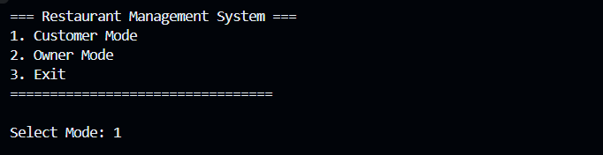
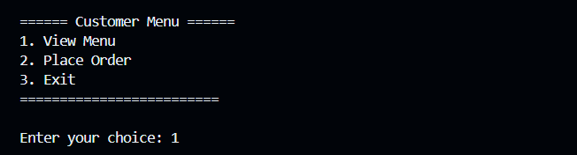
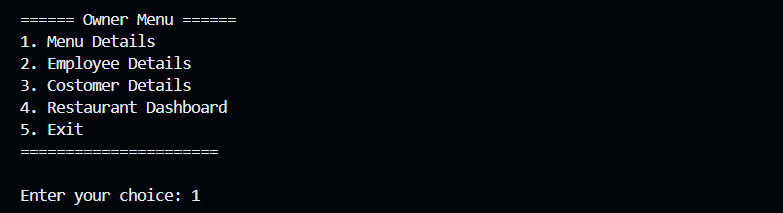
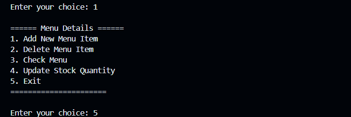
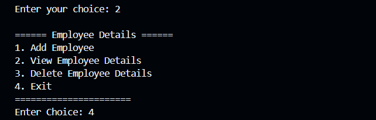
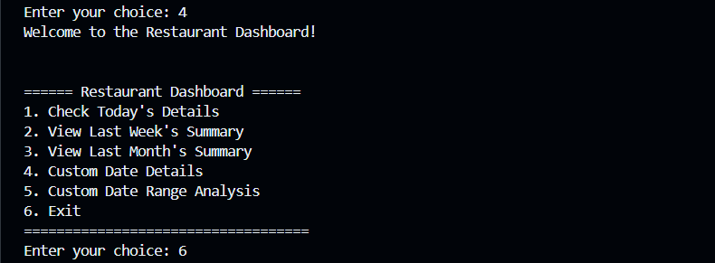

# 🍽️ Restaurant Management System (RMS)

### Project Group ID: **MPRJ_CPP_SY_A_07**

---

## 📄 Description

This Restaurant Management System is a console-based C++ application designed to streamline operations in a restaurant. The system supports two user modes: **Customer Mode** and **Owner Mode**, offering functionalities such as viewing the menu, placing orders, managing staff, tracking sales, and monitoring inventory.

The project utilizes core C++ concepts including **Object-Oriented Programming**, **File Handling**, **Exception Handling**, and the **Standard Template Library (STL)**. All restaurant data (menu, employees, orders, etc.) is stored in text files to simulate real-world persistence.

---

## 📑 Project Report

📎 [Click here to view the Project Report](https://drive.google.com/file/d/100s_Y74WfvpkTP-vxbnak1ltEtyCriDH/view?usp=sharing)

---

## 🎯 Objective

To implement a user-friendly restaurant management system using C++ that allows customers to place orders and owners to manage day-to-day operations such as inventory, employees, and sales tracking. The goal is to apply fundamental programming concepts to solve real-life problems effectively.

---

## 🛠️ Tools and Technologies Used

- **Language:** C++
- **Concepts Used:** File Handling, Exception Handling, OOP (Classes & Inheritance), STL (Vectors, Strings)
- **Compiler:** g++
- **IDE:** Visual Studio Code 
- **Text-based User Interface**

---

## 🚀 Features

### 🔹 Customer Mode
- View Menu
- Place Order

### 🔹 Owner Mode (Password Protected)
- **Menu Management:**
  - Add New Menu Item
  - Delete Menu Item
  - Check Menu
  - Update Stock Quantity
- **Employee Management:**
  - Add Employee
  - View Employee Details
  - Delete Employee
- **Customer Records:**
  - View Orders
- **Restaurant Dashboard:**
  - Check Today's Details
  - Weekly & Monthly Summaries
  - Custom Date Analysis

### 📁 Data Stored In:
- `menu.txt`
- `orders.txt`
- `customer.txt`
- `employee.txt`
- `owner.txt` (Contains password for owner mode)

---

## 🖼️ Screenshots

### RMS Dashboard

---

### Customer Dashboard

---

### Owner Dashboard

---

### Owner Dashboard - Menu Update

---

### Owner Dashboard - Employee Update

---

### Owner Dashboard - Data Analysis

---

## 👨‍💻 Contributors

- [Suhana Pendhari](https://github.com/Suhana-Pendhari)
- [Farhan Ibushe](https://github.com/Farhan6768)
- [Gangadhar Chougule](https://github.com/Gangadhar-chougule)

---

## 🙏 Special Thanks

> A heartfelt thank you to **Dr. Amol Dange Sir** for his valuable guidance and support throughout the development of this project.

---

## 📌 Note

- This project is for academic purposes only.
- All data used in `.txt` files is sample/demo data.

